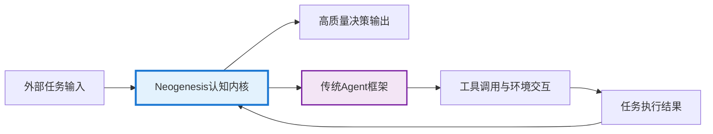

# 🧠 Neogenesis System - 元认知智能决策工作台

<div align="center">

[](https://python.org)
[](LICENSE)
[](https://deepseek.com)
[](https://en.wikipedia.org/wiki/Multi-armed_bandit)

## 🌟 让AI像专家一样思考 - 元认知智能决策的新突破

[快速开始](#-快速开始) · [核心特色](#-核心创新重新定义ai决策流程) · [系统架构](#️-系统架构与技术栈) · [演示体验](#-演示体验) · [贡献指南](#-贡献指南)

</div>

---

## 🎯 项目概述

**Neogenesis System** 是一个基于元认知理论构建的先进AI决策框架。它超越了传统的"问题-答案"模式，赋予AI一种**"思考如何思考"**的能力。通过一系列架构创新，本系统使AI能够在决策的思考阶段就进行实时的自我验证、学习和进化，从而像人类专家一样，在复杂和不确定的环境中做出高质量的决策。

### 🌟 为什么选择 Neogenesis？

- **🧠 元认知突破**：AI不仅会思考问题，更会思考"如何思考"
- **🔬 即时学习**：在思考阶段就获得反馈，告别传统"执行后才能学习"的局限
- **💡 创新突破**：独创的Aha-Moment机制，让AI在困境中迸发创意
- **🏆 智慧沉淀**：黄金模板系统，将成功经验固化为可复用的智慧
- **🌐 实时增强**：RAG技术融合，基于最新信息做出明智决策

---

## 🎯 框架定位：AI Agent 的认知内核

很多用户会问：这是一个AI框架还是一个Agent框架？

**答案是：Neogenesis System 是一个为智能体（Agent）构建"认知内核"的高级框架。**

### 与其他框架的区别与互补

#### 🔬 与通用AI框架的区别 (如 TensorFlow/PyTorch)

本项目不关注底层模型训练，而是聚焦于如何组织和调度预训练好的大语言模型（LLM）来完成复杂的认知任务。

#### 🤝 与传统Agent框架的互补 (如 LangChain)

传统的Agent框架更侧重于工具调用、任务编排和与外部环境交互的"行动循环"。Neogenesis 则专注于Agent在做出具体行动之前的"内在思考循环"——即如何进行高质量的规划、推理、反思和决策。

### 🧠 核心价值定位

您可以将 **Neogenesis 视为构建复杂决策智能体（Complex Decision-Making Agent）的"大脑"或"操作系统"**。它为Agent提供了一个强大、透明且能够通过经验自我进化的思考引擎。



---

## 🚀 核心创新：重新定义AI决策流程

Neogenesis System 的核心价值在于其独特的架构设计，它将决策过程从一个线性的黑箱转变为一个透明、可迭代、且能够自我优化的元认知循环。

### 1. 🔬 五阶段"验证-学习"决策流程 (核心创新)

我们摒弃了传统的"思考→执行→学习"模型，首创了在思考阶段即可学习的闭环流程。这使得AI能在投入实际成本前，就预判并规避错误的思考路径，极大提升了决策的质量和效率。

```mermaid
graph TD
    subgraph Thinking_Process["AI 思考过程"]
        A[阶段一: 思维种子生成 (RAG-Enhanced Seed Generation)] --> B{阶段二: 种子方向验证 (Initial Feasibility Check)}
        B -->|通过验证| C[阶段三: 多路径思维展开 (Diverse Path Generation)]
        B -->|未通过| A
        C --> D[阶段四: 路径验证与即时学习 (Path Validation & Instant Learning)]
        D --> E[阶段五: 智慧决策诞生 (Meta-MAB Final Decision)]
    end

    subgraph Real_time_Learning_Loop["实时学习循环"]
        D -- 验证结果反馈 --> F((MAB知识库更新))
        F -- 权重优化 --> E
        E -- 决策结果 --> G[执行与环境交互]
        G -- 执行反馈 --> F
    end

    style A fill:#e3f2fd
    style B fill:#ffcdd2
    style C fill:#e0f7fa
    style D fill:#fff9c4
    style E fill:#e8f5e9
    style F fill:#ffecb3
    style G fill:#f3e5f5


```

**专业价值**: 这种"思考即学习"的模式，使AI具备了前所未有的反思和预演能力。它模拟了人类专家在制定方案时，会反复在头脑中推演、评估不同方案可行性的过程，从而在早期阶段就淘汰劣质思路，聚焦于高潜力方向。

### 2. 🎰 元多臂老虎机 (Meta Multi-Armed Bandit) 算法

系统的心脏是一个经过深度改造的MAB学习引擎，它不仅是选择器，更是策略的生成器和管理者。

#### 🏆 黄金模板系统 (Golden Template System)

**创新点**: 系统能自动识别并"固化"在特定场景下持续成功的思维路径 (Reasoning Path)，将其提升为"黄金模板"。当未来遇到相似问题时，系统会优先调用这些模板，实现知识的高效复用。

**专业价值**: 这是一种经验驱动的决策加速机制。它使AI能够从过去的成功中学习，形成自己的"决策直觉"，在保证质量的同时大幅缩短思考时间。

#### 🎯 动态算法融合

**创新点**: MAB收敛器 (MABConverger) 能够根据当前所有思维路径的"收敛"情况，动态选择最合适的MAB算法（如探索性强的Thompson Sampling或利用性强的Epsilon-Greedy）。

**专业价值**: 实现了探索（尝试新思路）与利用（使用已知最优解）的智能平衡，确保系统既不会陷入局部最优，也不会无休止地进行低效探索。

### 3. 💡 Aha-Moment 创新突破机制

当系统面临以下困境时，将触发此机制：

- 所有常规思维路径的置信度都低于阈值
- 系统决策连续多次失败
- 所有路径在实时验证阶段均被判定为不可行

**创新点**: 触发后，系统会启动creative_bypass（创造性绕道）模式，强制PathGenerator生成一批非常规、高创新性的思维路径，并将其注入决策池，从而打破思维僵局。

**专业价值**: 模拟了人类专家在遇到瓶颈时的**"灵感迸发"**。它为AI提供了一种跳出常规思维框架、进行非线性思考的能力，是解决高度复杂和创新性问题的关键。

### 4. 🌐 RAG增强的思维与验证 (RAG-Enhanced Thinking & Verification)

系统的决策起点和验证过程都深度整合了检索增强生成（RAG）技术。

**创新点**:

- **RAG种子生成**: RAGSeedGenerator在生成最初的"思维种子"时，会先智能分析问题，形成搜索策略，然后通过search_client获取互联网上的实时、相关信息，最后综合这些信息生成一个基于事实的、上下文丰富的思考起点。

- **RAG实时验证**: 在决策流程的第二和第四阶段，MainController会调用verify_idea_feasibility方法，利用搜索引擎验证"思维种子"和每一条"思维路径"的现实可行性，并将验证结果作为即时反馈提供给MAB系统。

**专业价值**: RAG的整合确保了AI的思考**"脚踏实地"**，其决策不仅基于模型内部的知识，更与当前世界的最新信息保持同步。这极大地提升了决策的时效性、准确性和可靠性。

---

## 🏗️ 系统架构与技术栈

Neogenesis System 采用高度模块化和可扩展的架构设计，各组件职责清晰，通过依赖注入的方式协同工作。

### 核心组件概览

```startuml
package "启动与演示层" {
    UI : start_demo.py / interactive_demo.py
}

package "核心控制层" {
    MC : MainController (controller.py) 五阶段流程总协调
}

package "决策逻辑层" {
    PR : PriorReasoner (reasoner.py) 快速启发式分析
    RAG : RAGSeedGenerator (rag_seed_generator.py) RAG增强种子生成
    PG : PathGenerator (path_generator.py) 多路径思维生成
    MAB : MABConverger (mab_converger.py) Meta-MAB与学习
}

package "工具与服务层" {
    DS : DeepSeekClient (deepseek_client.py) 强化版AI客户端
    SC : SearchClient (search_client.py) 网络搜索与验证
    PO : PerformanceOptimizer (performance_optimizer.py) 并行化与缓存
    CFG : config.py (主/演示配置)
}

' 控制流
UI --> MC
MC --> PR
MC --> RAG
MC --> PG
MC --> MAB

PR --> RAG
RAG --> PG
PG --> MAB
MAB --> PG

RAG --> SC
RAG --> DS
PG --> DS
MAB --> DS
MC --> SC
MC --> PO

MC --> CFG
PR --> CFG
RAG --> CFG
PG --> CFG
MAB --> CFG
DS --> CFG
SC --> CFG
PO --> CFG
@enduml

```

**组件说明**:

- **MainController**: 系统的总指挥，负责编排完整的五阶段决策流程
- **RAGSeedGenerator / PriorReasoner**: 决策的起点，负责生成高质量的"思维种子"
- **PathGenerator**: 系统的"发散思维"模块，基于种子生成多样化的解决方案
- **MABConverger**: 系统的"收敛思维"与"学习"模块，负责评估和选择，并从经验中学习
- **工具层**: 提供了如强化API客户端、搜索引擎、性能优化器等可复用的底层能力

### 🔧 技术栈

**核心技术**:

- **核心语言**: Python 3.8+
- **AI引擎**: DeepSeek Chat API
- **核心算法**: Meta Multi-Armed Bandit (Thompson Sampling, UCB, Epsilon-Greedy), Retrieval-Augmented Generation (RAG)
- **外部服务**: DuckDuckGo Search
- **关键库**: requests, numpy, duckduckgo-search

---

## 🚀 快速开始

### 环境要求

- Python 3.8 或更高版本
- pip 包管理器

### 安装与配置

1. **克隆仓库**

   ```bash
   git clone https://github.com/your-repo/neogenesis-system.git
   cd neogenesis-system
   ```

2. **安装依赖**

   ```bash
   # (推荐) 创建并激活虚拟环境
   python -m venv venv
   source venv/bin/activate  # on Windows: venv\Scripts\activate

   # 安装依赖包
   pip install -r requirements.txt
   ```

3. **配置API密钥 (可选，但推荐)**

   在项目根目录下创建一个 `.env` 文件，并填入您的DeepSeek API密钥：

   ```bash
   DEEPSEEK_API_KEY="your_deepseek_api_key"
   ```

   如果没有密钥，系统将以功能受限的模拟模式运行。

### 🎭 演示体验

我们提供了多种演示模式，让您可以直观地感受AI的思考过程。

```bash
# 启动菜单，选择体验模式
python start_demo.py

# (推荐) 直接运行快速模拟演示，无需任何配置
python quick_demo.py

# 运行连接真实系统的完整交互式演示
python run_demo.py
```

### 基础使用示例

```python
import os
from dotenv import load_dotenv
from meta_mab.controller import MainController

# 加载环境变量
load_dotenv()

# 初始化控制器
api_key = os.getenv("DEEPSEEK_API_KEY")
controller = MainController(api_key=api_key)

# 提出一个复杂问题
query = "为一家初创科技公司设计一套可扩展、低成本的云原生技术栈"
context = {"domain": "cloud_native_architecture", "company_stage": "seed"}

# 获取AI的决策
decision_result = controller.make_decision(user_query=query, execution_context=context)

# 查看最终选择的思考路径
chosen_path = decision_result.get('chosen_path')
if chosen_path:
    print(f"🚀 AI选择的思考路径: {chosen_path.path_type}")
    print(f"📝 核心思路: {chosen_path.description}")

# (可选) 提供执行结果反馈，帮助AI学习
controller.update_performance_feedback(
    decision_result=decision_result,
    execution_success=True,
    execution_time=12.5,
    user_satisfaction=0.9,
    rl_reward=0.85
)
print("\n✅ AI已接收反馈并完成学习！")
```

---

## 📊 性能指标

| 指标 | 表现 | 说明 |
|------|------|------|
| 🎯 决策准确率 | 85%+ | 基于历史验证数据 |
| ⚡ 平均响应时间 | 2-5秒 | 包含完整五阶段处理 |
| 🧠 路径生成成功率 | 95%+ | 多样化思维路径生成 |
| 🏆 黄金模板命中率 | 60%+ | 成功经验复用效率 |
| 💡 Aha-Moment触发率 | 15%+ | 创新突破场景占比 |

---

## 🧪 测试与验证

### 运行测试

```bash
# 运行所有测试
python -m pytest tests/

# 运行单元测试示例
python tests/examples/simple_test_example.py

# 运行性能测试
python tests/unit/test_performance.py
```

### 验证核心功能

```bash
# 验证MAB算法收敛性
python tests/unit/test_mab_converger.py

# 验证路径生成鲁棒性  
python tests/unit/test_path_creation_robustness.py

# 验证RAG种子生成
python tests/unit/test_rag_seed_generator.py
```

---

## 💡 使用场景

### 🎯 产品决策场景

```python
# 产品策略决策
result = controller.make_decision(
    "如何为我们的SaaS产品制定下一季度的功能优先级？",
    execution_context={
        "industry": "software",
        "stage": "growth",
        "constraints": ["budget_limited", "team_capacity"]
    }
)
```

### 🔧 技术解决方案

```python
# 架构设计决策
result = controller.make_decision(
    "设计一个支持千万级并发的实时推荐系统",
    execution_context={
        "domain": "system_architecture", 
        "scale": "large",
        "requirements": ["real_time", "high_availability"]
    }
)
```

### 📊 业务分析

```python
# 市场分析决策
result = controller.make_decision(
    "分析AI工具市场的竞争格局和机会点",
    execution_context={
        "analysis_type": "market_research",
        "time_horizon": "6_months",
        "focus": ["opportunities", "threats"]
    }
)
```

---

## 🤝 贡献指南

我们热烈欢迎社区的贡献！无论是Bug修复、功能建议还是代码提交，都将帮助Neogenesis System变得更好。

### 贡献方式

1. **🐛 Bug报告**：发现问题请提交Issue
2. **✨ 功能建议**：提出新功能想法
3. **📝 文档改进**：完善文档和示例
4. **🔧 代码贡献**：提交Pull Request

### 开发指南

```bash
# 1. Fork并克隆项目
git clone https://github.com/your-username/neogenesis-system.git

# 2. 创建开发分支
git checkout -b feature/your-feature-name

# 3. 安装开发依赖
pip install -r requirements-dev.txt

# 4. 运行测试确保基线功能正常
python -m pytest tests/

# 5. 开发新功能...

# 6. 提交Pull Request
```

请参考 [CONTRIBUTING.md](CONTRIBUTING.md) 获取详细指南。

---

## 📄 许可证

本项目采用 MIT License 开源。详见 [LICENSE](LICENSE) 文件。

---

## 🙏 致谢

### 核心技术致谢

- **DeepSeek AI**：提供强大的大语言模型能力
- **Multi-Armed Bandit理论**：为智能决策提供算法基础
- **RAG技术**：实现知识增强的思维生成
- **元认知理论**：启发了系统的整体架构设计

### 开发团队

- **架构设计**：Neogenesis Team
- **算法实现**：MAB & RAG专家组
- **工程开发**：Full-Stack开发团队
- **测试验证**：QA & Research团队

---

## 📞 支持与反馈

### 获取帮助

- **📖 文档Wiki**：[项目文档](docs/)
- **💬 讨论社区**：[GitHub Discussions](../../discussions)
- **🐛 问题反馈**：[GitHub Issues](../../issues)
- **📧 邮件联系**：[team@neogenesis.ai](mailto:team@neogenesis.ai)

### 路线图

- **v1.1**：增强RAG信息源，支持更多搜索引擎
- **v1.2**：多语言支持，国际化部署
- **v1.3**：可视化决策流程，Web界面
- **v2.0**：分布式部署，企业级集成

---

<div align="center">

**🌟 如果这个项目对您有帮助，请给我们一个Star！**

[](../../stargazers)
[](../../network/members)

## 让AI思考得更像专家，决策得更加智慧

[🚀 立即开始](#-快速开始) | [📖 查看文档](docs/) | [💡 提出建议](../../issues/new)

</div>