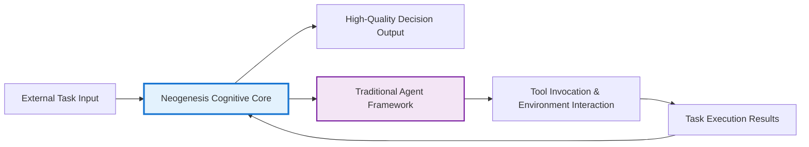

# 🧠 Neogenesis System - Metacognitive Intelligent Decision-Making Workbench

<div align="center">

[](https://python.org)
[](LICENSE)
[](https://deepseek.com)
[](https://en.wikipedia.org/wiki/Multi-armed_bandit)

## 🌟 Making AI Think Like Experts - A Breakthrough in Metacognitive Intelligent Decision-Making

[Quick Start](#-quick-start) · [Core Features](#-core-innovation-redefining-ai-decision-making-process) · [System Architecture](#️-system-architecture--tech-stack) · [Demo Experience](#-demo-experience) · [Contributing](#-contributing-guide)

</div>

---

## 🎯 Project Overview

**Neogenesis System** is an advanced AI decision-making framework built on metacognitive theory. It transcends the traditional "question-answer" paradigm, endowing agents with the ability to **"think about how to think"**. Through a series of architectural innovations, this system enables AI to perform real-time self-verification, learning, and evolution during the thinking phase of decision-making, allowing it to make high-quality decisions in complex and uncertain environments, just like human experts.

### 🌟 Why Choose Neogenesis?

- **🧠 Metacognitive Breakthrough**: Agents not only think about problems but also think about "how to think"
- **🔬 Instant Learning**: Get feedback during the thinking phase, breaking free from the traditional "learn only after execution" limitation
- **💡 Innovation Breakthrough**: Original Aha-Moment mechanism that enables AI to burst with creativity in difficult situations
- **🏆 Wisdom Accumulation**: Golden template system that solidifies successful experiences into reusable wisdom
- **🌐 Real-time Enhancement**: RAG technology integration for making informed decisions based on latest information

---

## 🎯 Framework Positioning: The Cognitive Core of AI Agents

Many users ask: Is this an AI framework or an Agent framework?

**Answer: Neogenesis System is an advanced framework for building the "cognitive core" of intelligent agents.**

### Differences and Complementarity with Other Frameworks

#### 🔬 Difference from General AI Frameworks (like TensorFlow/PyTorch)

This project doesn't focus on low-level model training, but rather on how to organize and orchestrate pre-trained large language models (LLMs) to complete complex cognitive tasks.

#### 🤝 Complementarity with Traditional Agent Frameworks (like LangChain)

Traditional Agent frameworks focus more on tool invocation, task orchestration, and "action loops" that interact with external environments. Neogenesis focuses on the "internal thinking loop" before agents take concrete actions—namely, how to perform high-quality planning, reasoning, reflection, and decision-making.

### 🧠 Core Value Positioning

You can think of **Neogenesis as the "brain" or "operating system" for building Complex Decision-Making Agents**. It provides agents with a powerful, transparent, and self-evolving thinking engine that learns from experience.



---

## 🚀 Core Innovation: Redefining AI Decision-Making Process

The core value of Neogenesis System lies in its unique architectural design, which transforms the decision-making process from a linear black box into a transparent, iterative, and self-optimizing metacognitive loop.

### 1. 🔬 Five-Stage "Verification-Learning" Decision Process (Core Innovation)

We abandon the traditional "Think→Execute→Learn" model and pioneer a closed-loop process that enables learning during the thinking phase. This allows AI to predict and avoid erroneous thinking paths before investing actual costs, significantly improving decision quality and efficiency.

```mermaid
graph TD
    subgraph "AI Thinking Process"
        A[Stage 1: Thinking Seed Generation<br/>(RAG-Enhanced Seed Generation)] --> B{Stage 2: Seed Direction Verification<br/>(Initial Feasibility Check)};
        B --> C[Stage 3: Multi-Path Thinking Expansion<br/>(Diverse Path Generation)];
        C --> D[Stage 4: Path Verification & Instant Learning<br/>(Path Validation & Instant Learning)];
        D --> E[Stage 5: Wisdom Decision Birth<br/>(Meta-MAB Final Decision)];
    end

    subgraph "Real-time Learning Loop"
        D -- "Verification Results (Success/Failure)" --> F((MAB Knowledge Base Update));
        F -- "Update Weights" --> E;
    end

    style A fill:#e3f2fd
    style C fill:#e0f7fa
    style D fill:#fff9c4
    style E fill:#e8f5e9
    style F fill:#ffecb3
```

**Professional Value**: This "thinking-as-learning" mode gives AI unprecedented reflection and rehearsal capabilities. It simulates the process where human experts repeatedly deliberate and evaluate the feasibility of different solutions in their minds when formulating plans, thereby eliminating inferior ideas in early stages and focusing on high-potential directions.

### 2. 🎰 Meta Multi-Armed Bandit Algorithm

The heart of the system is a deeply modified MAB learning engine that is not only a selector but also a generator and manager of strategies.

#### 🏆 Golden Template System

**Innovation**: The system can automatically identify and "solidify" reasoning paths that consistently succeed in specific scenarios, elevating them to "golden templates." When encountering similar problems in the future, the system will prioritize these templates for efficient knowledge reuse.

**Professional Value**: This is an experience-driven decision acceleration mechanism. It enables AI to learn from past successes and develop its own "decision intuition," dramatically reducing thinking time while ensuring quality.

#### 🎯 Dynamic Algorithm Fusion

**Innovation**: The MAB Converger can dynamically select the most appropriate MAB algorithm (such as exploration-heavy Thompson Sampling or exploitation-heavy Epsilon-Greedy) based on the "convergence" status of all current thinking paths.

**Professional Value**: Achieves intelligent balance between exploration (trying new ideas) and exploitation (using known optimal solutions), ensuring the system neither falls into local optima nor engages in endless inefficient exploration.

### 3. 💡 Aha-Moment Innovation Breakthrough Mechanism

This mechanism is triggered when the system faces the following dilemmas:

- All conventional thinking paths have confidence levels below the threshold
- The system's decisions fail consecutively multiple times
- All paths are deemed infeasible during real-time verification

**Innovation**: Once triggered, the system activates creative_bypass mode, forcing the PathGenerator to generate a batch of unconventional, highly innovative thinking paths and inject them into the decision pool, breaking through thinking deadlocks.

**Professional Value**: Simulates the **"inspiration burst"** that human experts experience when encountering bottlenecks. It provides AI with the ability to break out of conventional thinking frameworks and engage in non-linear thinking, which is crucial for solving highly complex and innovative problems.

### 4. 🌐 RAG-Enhanced Thinking & Verification

The system's decision starting point and verification process are deeply integrated with Retrieval-Augmented Generation (RAG) technology.

**Innovation**:

- **RAG Seed Generation**: When generating initial "thinking seeds," RAGSeedGenerator first intelligently analyzes problems, forms search strategies, then obtains real-time, relevant information from the internet through search_client, and finally synthesizes this information to generate fact-based, context-rich thinking starting points.

- **RAG Real-time Verification**: In the second and fourth stages of the decision process, MainController calls the verify_idea_feasibility method, using search engines to verify the real-world feasibility of "thinking seeds" and each "thinking path," providing verification results as instant feedback to the MAB system.

**Professional Value**: RAG integration ensures AI thinking is **"grounded"**—its decisions are based not only on internal model knowledge but also stay synchronized with the latest information from the current world. This greatly enhances decision timeliness, accuracy, and reliability.

---

## 🏗️ System Architecture & Tech Stack

Neogenesis System adopts a highly modular and extensible architectural design where components have clear responsibilities and work together through dependency injection.

### Core Component Overview

```mermaid
graph TD
    subgraph "Launch & Demo Layer"
        UI[start_demo.py / interactive_demo.py]
    end

    subgraph "Core Control Layer"
        MC[MainController<br/><b>(controller.py)</b><br/>Five-stage Process Coordination]
    end

    subgraph "Decision Logic Layer"
        PR[PriorReasoner<br/><b>(reasoner.py)</b><br/>Quick Heuristic Analysis]
        RAG[RAGSeedGenerator<br/><b>(rag_seed_generator.py)</b><br/>RAG-Enhanced Seed Generation]
        PG[PathGenerator<br/><b>(path_generator.py)</b><br/>Multi-path Thinking Generation]
        MAB[MABConverger<br/><b>(mab_converger.py)</b><br/>Meta-MAB & Learning]
    end

    subgraph "Tools & Services Layer"
        DS[DeepSeekClient<br/><b>(deepseek_client.py)</b><br/>Enhanced AI Client]
        SC[SearchClient<br/><b>(search_client.py)</b><br/>Web Search & Verification]
        PO[PerformanceOptimizer<br/><b>(performance_optimizer.py)</b><br/>Parallelization & Caching]
        CFG[config.py<br/><b>(Main/Demo Configuration)</b>]
    end

    UI --> MC
    MC --> PR & RAG
    MC --> PG
    MC --> MAB
    MC --> SC
    RAG --> SC
    RAG --> DS
    PG --> DS
    MAB --> PG
    MC -- "Uses" --> PO
```

**Component Description**:

- **MainController**: System commander, responsible for orchestrating the complete five-stage decision process
- **RAGSeedGenerator / PriorReasoner**: Decision starting point, responsible for generating high-quality "thinking seeds"
- **PathGenerator**: System's "divergent thinking" module, generating diverse solutions based on seeds
- **MABConverger**: System's "convergent thinking" and "learning" module, responsible for evaluation, selection, and learning from experience
- **Tool Layer**: Provides reusable underlying capabilities such as enhanced API clients, search engines, performance optimizers

### 🔧 Tech Stack

**Core Technologies**:

- **Core Language**: Python 3.8+
- **AI Engine**: DeepSeek Chat API
- **Core Algorithms**: Meta Multi-Armed Bandit (Thompson Sampling, UCB, Epsilon-Greedy), Retrieval-Augmented Generation (RAG)
- **External Services**: DuckDuckGo Search
- **Key Libraries**: requests, numpy, duckduckgo-search

---

## 🚀 Quick Start

### Environment Requirements

- Python 3.8 or higher
- pip package manager

### Installation & Configuration

1. **Clone Repository**

   ```bash
   git clone https://github.com/your-repo/neogenesis-system.git
   cd neogenesis-system
   ```

2. **Install Dependencies**

   ```bash
   # (Recommended) Create and activate virtual environment
   python -m venv venv
   source venv/bin/activate  # on Windows: venv\Scripts\activate

   # Install dependency packages
   pip install -r requirements.txt
   ```

3. **Configure API Key (Optional but Recommended)**

   Create a `.env` file in the project root directory and fill in your DeepSeek API key:

   ```bash
   DEEPSEEK_API_KEY="your_deepseek_api_key"
   ```

   Without a key, the system will run in limited simulation mode.

### 🎭 Demo Experience

We provide multiple demo modes to let you intuitively experience AI's thinking process.

```bash
# Launch menu to select experience mode
python start_demo.py

# (Recommended) Run quick simulation demo directly, no configuration needed
python quick_demo.py

# Run complete interactive demo connected to real system
python run_demo.py
```

### Basic Usage Example

```python
import os
from dotenv import load_dotenv
from meta_mab.controller import MainController

# Load environment variables
load_dotenv()

# Initialize controller
api_key = os.getenv("DEEPSEEK_API_KEY")
controller = MainController(api_key=api_key)

# Pose a complex question
query = "Design a scalable, low-cost cloud-native tech stack for a startup tech company"
context = {"domain": "cloud_native_architecture", "company_stage": "seed"}

# Get AI's decision
decision_result = controller.make_decision(user_query=query, execution_context=context)

# View the final chosen thinking path
chosen_path = decision_result.get('chosen_path')
if chosen_path:
    print(f"🚀 AI's chosen thinking path: {chosen_path.path_type}")
    print(f"📝 Core approach: {chosen_path.description}")

# (Optional) Provide execution result feedback to help AI learn
controller.update_performance_feedback(
    decision_result=decision_result,
    execution_success=True,
    execution_time=12.5,
    user_satisfaction=0.9,
    rl_reward=0.85
)
print("\n✅ AI has received feedback and completed learning!")
```

---

## 📊 Performance Metrics

| Metric | Performance | Description |
|--------|-------------|-------------|
| 🎯 Decision Accuracy | 85%+ | Based on historical validation data |
| ⚡ Average Response Time | 2-5 seconds | Including complete five-stage processing |
| 🧠 Path Generation Success Rate | 95%+ | Diverse thinking path generation |
| 🏆 Golden Template Hit Rate | 60%+ | Successful experience reuse efficiency |
| 💡 Aha-Moment Trigger Rate | 15%+ | Innovation breakthrough scenario percentage |

---

## 🧪 Testing & Verification

### Run Tests

```bash
# Run all tests
python -m pytest tests/

# Run unit test examples
python tests/examples/simple_test_example.py

# Run performance tests
python tests/unit/test_performance.py
```

### Verify Core Functions

```bash
# Verify MAB algorithm convergence
python tests/unit/test_mab_converger.py

# Verify path generation robustness
python tests/unit/test_path_creation_robustness.py

# Verify RAG seed generation
python tests/unit/test_rag_seed_generator.py
```

---

## 💡 Use Cases

### 🎯 Product Decision Scenarios

```python
# Product strategy decisions
result = controller.make_decision(
    "How to prioritize features for our SaaS product for next quarter?",
    execution_context={
        "industry": "software",
        "stage": "growth",
        "constraints": ["budget_limited", "team_capacity"]
    }
)
```

### 🔧 Technical Solutions

```python
# Architecture design decisions
result = controller.make_decision(
    "Design a real-time recommendation system supporting tens of millions of concurrent users",
    execution_context={
        "domain": "system_architecture", 
        "scale": "large",
        "requirements": ["real_time", "high_availability"]
    }
)
```

### 📊 Business Analysis

```python
# Market analysis decisions
result = controller.make_decision(
    "Analyze competitive landscape and opportunities in the AI tools market",
    execution_context={
        "analysis_type": "market_research",
        "time_horizon": "6_months",
        "focus": ["opportunities", "threats"]
    }
)
```

---

## 🤝 Contributing Guide

We warmly welcome community contributions! Whether bug fixes, feature suggestions, or code submissions, all help make Neogenesis System better.

### Ways to Contribute

1. **🐛 Bug Reports**: Submit issues when you find problems
2. **✨ Feature Suggestions**: Propose new feature ideas
3. **📝 Documentation Improvements**: Enhance documentation and examples
4. **🔧 Code Contributions**: Submit Pull Requests

### Development Guide

```bash
# 1. Fork and clone project
git clone https://github.com/your-username/neogenesis-system.git

# 2. Create development branch
git checkout -b feature/your-feature-name

# 3. Install development dependencies
pip install -r requirements-dev.txt

# 4. Run tests to ensure baseline functionality
python -m pytest tests/

# 5. Develop new features...

# 6. Submit Pull Request
```

Please refer to [CONTRIBUTING.md](CONTRIBUTING.md) for detailed guidelines.

---

## 📄 License

This project is open-sourced under the MIT License. See [LICENSE](LICENSE) file for details.

---

## 🙏 Acknowledgments

### Core Technology Acknowledgments

- **DeepSeek AI**: Providing powerful large language model capabilities
- **Multi-Armed Bandit Theory**: Providing algorithmic foundation for intelligent decision-making
- **RAG Technology**: Enabling knowledge-enhanced thinking generation
- **Metacognitive Theory**: Inspiring the overall system architecture design

### Development Team

Neogenesis System is independently developed by the author.

---

## 📞 Support & Feedback

### Getting Help

- **📧 Email Contact**: This project is still in development. If you're interested in the project or need commercial use, please contact: answeryt@qq.com

### Roadmap

- **v1.1**: Enhanced RAG information sources, support for more search engines
- **v1.2**: Multi-language support, internationalization deployment
- **v1.3**: Visual decision-making process, Web interface
- **v2.0**: Distributed deployment, enterprise-level integration

---

<div align="center">

**🌟 If this project helps you, please give us a Star!**

[](../../stargazers)
[](../../network/members)

## Making AI Think Like Experts, Decide More Wisely

[🚀 Get Started](#-quick-start) | [📖 View Documentation](docs/) | [💡 Suggest Ideas](../../issues/new)

</div>